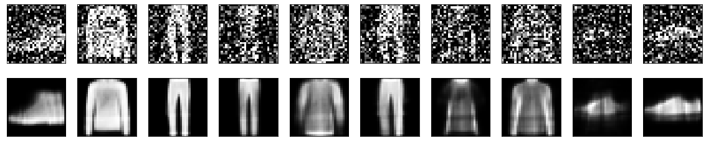

# Denoising-Autoencoders
Denoising Autoencoder Keras on MNIST Dataset
Autoencoders are Neural Networks which are commonly used for feature selection and extraction. However, when there are more nodes in the hidden layer than there are inputs, the Network is risking to learn the so-called “Identity Function”, also called “Null Function”, meaning that the output equals the input, marking the Autoencoder useless.

Denoising Autoencoders solve this problem by corrupting the data on purpose by randomly turning some of the input values to zero. In general, the percentage of input nodes which are being set to zero is about 50%. Other sources suggest a lower count, such as 30%. It depends on the amount of data and input nodes you have.

